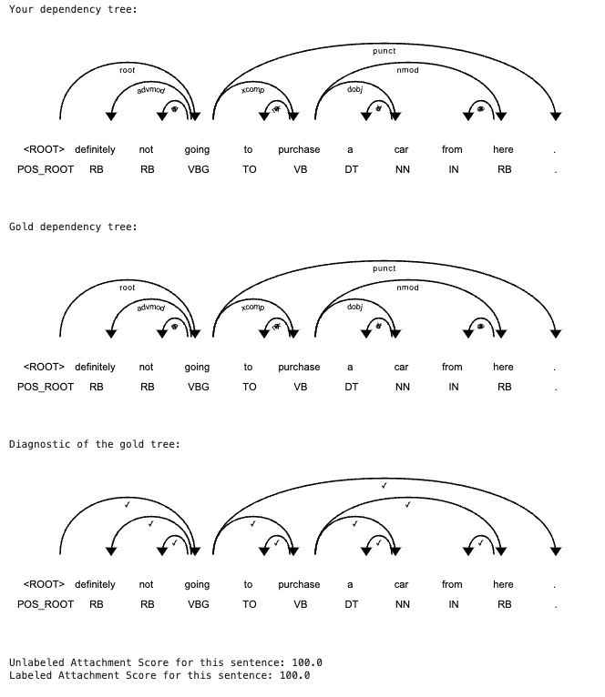

# Neural Grammar Dependency Parsing
+ Implemented a neural grammar dependency parser for natural language processing tasks using PyTorch and a Recurrent Neural Network (RNN) model. 
+ The project involved developing a model capable of parsing sentences and predicting syntactic dependency structures, identifying the grammatical relationships between words. The workflow includes data preprocessing, feature extraction, and model training with dependency-labeled datasets. 
+ By leveraging tokenization and sequence modeling, the parser learns to predict complex grammatical dependencies. The project’s application ranges from syntactic analysis to enhancing tasks like machine translation, automated grammar correction, and information extraction. Comprehensive evaluation and optimization were conducted to improve parsing accuracy and model performance, making it suitable for a wide array of NLP applications.
+ Here is an example of predicting and evaluating the dependency tree of the sentence: "definitely not going to purchase a car from here."
  
  
